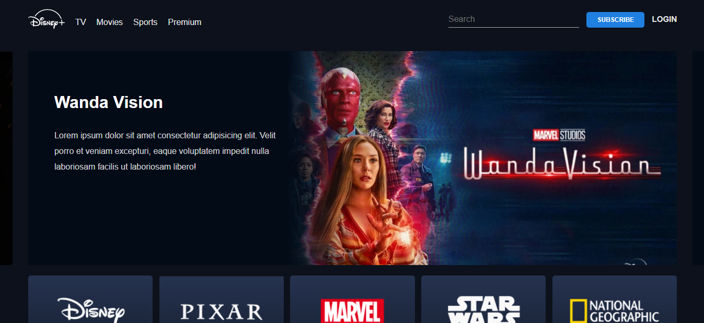

# Project - Disney+ Clone 

## Description
This frontend project is developed in order to make good practice in frontend web development.

---

>Hello Guys, I tried to make this project by referring the project video uploaded by ```Devtown``` on the youtube after completing their 7-days long ```bootcamp``` on hotstar clone using pure html, css and javascript. 

---
## Github Pages Link
https://amrutgawade.github.io/Hostar-Clone/

---

## Output
      

